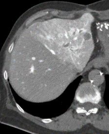
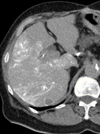
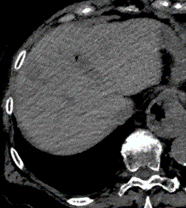
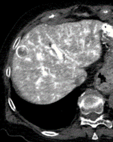
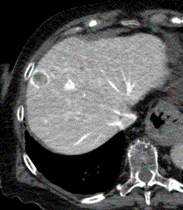
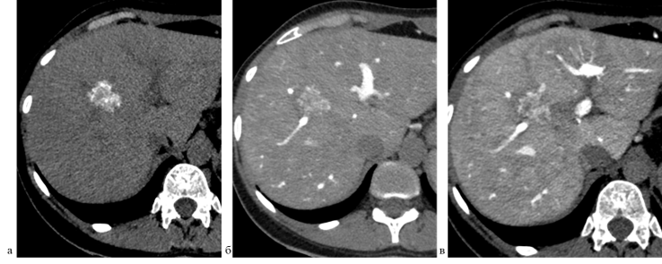

# Введение

Колоректальный рак (КРР) занимает третье место в структуре онкологической заболеваемости в мире с 1,1 млн новых случаев ежегодно и является второй ведущей причиной смерти от злокачественных новообразований [@sung2021glo]. В России в 2022 г. выявлено 35 623 случая рака ободочной кишки и 26 907 случаев опухолей прямой кишки, ректосигмоидного соединения и анального канала [@kaprin2023sos]. Метастазы в печени выявляются у 25% пациентов на момент первичной диагностики КРР и у 50% пациентов в течение двух лет после удаления первичной опухоли [@vancutsem2016esm]. Значительная часть микрометастазов (<10 мм) остается невыявленной из-за ограничений современных методов визуализации [@zech2007mri]. По данным аутопсий, 40% пациентов умирают от прогрессирования исключительно печеночных метастазов, что подчеркивает их роль как основного источника системного метастазирования [@vancutsem2006tow].

Хирургические методы и радиочастотная абляция являются эффективными способами лечения метастатического колоректального рака [@abdalla2004rec]. Эффективность этих методов напрямую зависит от точности определения числа выявленных метастазов [@pawlik2008exp].

Точность выявления метастазов диаметром >10 мм достигает 87% для КТ и 89% для МРТ, но снижается до 32–60% для образований <10 мм [@bipat2005col]. Интраоперационное УЗИ повышает точность выявления на 40% [@mazzoni2008int]. Несмотря на это, частота невыявленных метастазов и рецидивов в печени остается на уровне 60-70% [@jones2012sys].

<!--Добавить что выявление основано на двух симптомах гиподенсности и ободке-->
Выявление метастазов основано на различиях контраста между метастазом и окружающей тканью печени на нативных изображениях или на фоне введения контрастного препарата: йодсодержащего при КТ, гадолиний содержащего при МРТ, микропузырьков при УЗИ [@oldenburg2005det]. Увеличение контрастности достигается увеличением концентрации контрастирующих веществ, применением спектрального сканирования при КТ, использованием гепатоспецифичных препаратов при МРТ и прямым введением контрастного вещества в сосуды печени [@tsurusaki2016cur].

Гепатикография и возвратная портография широко использовались для выявления метастазов печени с помощью рентгеноскопии в 1970-80-х годах и КТ [@freeny1986col]. Технология применяется для выявления гиперваскулярных образований [@hayashi2002pro]. Выявление гиповаскулярных метастазов колоректального рака затруднено выраженными артефактами, связанными с неравномерностью перфузии печени [@schwartz2006pro]. Новое дыхание технология получила с появлением плоскодетекторной КТ и появлением новых протоколов сканирования [@miyayama2012com, @balakhnin2018vnu]. 
Контрастное вещество вымывается из артериального русла через 30-40 секунд после окончания введения, минимизируя артефакты перфузии. <!-- Это откуда? Вроде там счет на несколько секунд. -->
При этом за счет длительного введения контрастного вещества увеличивается ободок накопления контрастного вещества вокруг метастаза. Метастазы выявляются не на основании разности контрастирования метастаза и паренхимы, а за счет появления дополнительного признака [@balakhnin2018vnu]. 
Ободок накопления является известным признаком метастаза печени при КТ и МРТ с высокой специфичностью, но встречается только в 35-89% метастазов колоректального рака [@cheng2020enhanced]. <!--Надо подумать. Вероятно стоит про высокую специфичность ободка перенести в предыдущий абзац-->
При ПДКТ частота встречаемости этого признака составляет 100% [@balakhnin2018intraarterial].

Отношение сигнал/шум и чувствительность к артефактам дыхания у ПДКТ хуже, чем у КТ, поэтому целесообразно изучение протокола введения контрастного вещества, используемого при ПДКТ, в других модальностях.<!--Это надо подтвердить ссылками на литературу-->
Спиральная КТ отличаются от ПДКТ по длительности сканирования, контрастности изображений, возможностям точного позиционирования катетера и максимальному допустимому инжекторами давлению. На первых этапах изучения этого подхода требуется оценка качества получаемых изображений, воспроизводимости получения капиллярной фазы контрастирования печени и ободка контрастирования метастаза колоректального рака после неоадъювантного лечения.

# Цель 

Предложить и апробировать методику КТ-артериогепатикографии для диагностики метастазов колоректального рака в печени после химиотерапии и описать КТ-семиотику соответствующих очагов.

# Материалы и методы
## Пациенты
В исследование включено 12 пациентов с колоректальным раком и метастазами в печени в возрасте от 37 до 78 лет, обследованных в ФГБУ «НМИЦ онкологии им. Н.Н. Петрова» Минздрава России. Все пациенты получали неоадъювантную химиотерапию на амбулаторном этапе с последующей госпитализацией для абляции или резекции метастазов печени. Выполнено 12 исследований КТ с внутриартериальным контрастированием.

## Методика КТ-артериогепатикографии
Прототипом для предлагаемой методики КТ-артериогепатикографии послужил способ ПДКТ-артериогепатикографии с внутриартериальным введением 40 мл йодсодержащего контрастного препарата с концентрацией йода 370 мг/мл со скоростью инфузии 2 мл/сек [@balakhnin2018intraarterial]. Данный способ введения контрастного препарата необходим для получения капиллярной фазы, когда контрастное вещество отсутствует в печеночных артериях и присутствует в паренхиме печени и печеночных венах. Капиллярная фаза характеризуется оптимальными условиями для визуализации гиповаскулярных метастазов за счет формирования периферического ободка контрастирования вокруг очагов, который обладает высокой специфичностью для метастатического поражения печени [@granata2019diagnostic].<!--Это текст не для материалов и методов. Лучше подходит для обсуждения.-->

Всем пациентам в условиях рентгеноперационной под местной анестезией 1% раствором лидокаина 10,0 выполнялась катетеризация правой бедренной артерии по Сельдингеру, чревного ствола и общей печеночной артерии при типичной анатомии целиако-мезентерального бассейна с использованием ангиографического катетера Cobra C2 5F и управляемого проводника. При вариантной анатомии с отхождением печеночных артерий от разных сосудов устанавливалось два катетера. Пациента на каталке транспортировали в отделение лучевой диагностики для выполнения МСКТ с внутриартериальным контрастированием.

КТ-исследование проводили на 128-срезовом КТ с параметрами: напряжение трубки 120 kV, автоматический контроль экспозиции, толщина среза 2 мм, питч 1. Зона сканирования ограничивалась печенью. Использовали контрастные препараты с содержанием йода 300-320 мг/мл.

При кровоснабжении печени из одной артерии вводили 40 мл неразведенного йодсодержащего контрастного препарата со скоростью 2 мл/с. При вариантной анатомии контрастное вещество вводили последовательно в каждую артерию по 20 мл со скоростью 1 мл/с. Сканирование выполняли на 22 секунде от начала введения контрастного вещества для получения капиллярной фазы. У 10 пациентов проводили вторую фазу на 38 секунде. Такая задержка обусловлена минимальным временем, необходимым для возврата стола томографа и подготовки к повторному сканированию. 

## Анализ изображений 

### Оценка перфузионных изменений в печени
Во все фазы сканирования оценивались участки транзиторного артериального усиления печени (ТАУП), которые представляли собой гиперденсные зоны неизмененной паренхимы печени [@kim2001transient]. Основными дифференциально-диагностическими критериями ТАУП от патологических образований печени служили отсутствие масс-эффекта на соседние структуры, сохранность внутрипеченочного сосудистого рисунка в зоне изменений и характерная клиновидная или трапециевидная форма [@colagrande2008transient]. Анализировалось распределение данных изменений в паренхиме печени: сегментарное, долевое, полиморфное или диффузное.

### Оценка частоты и выраженности визуализации ободка контрастирования метастазов
Первым этапом определялось наличие гиперваскулярного ободка, критерием которого служило визуальное увеличение плотности линейной зоны по периферии образования [@irie1995ct]. При обнаружении ободка проводилось измерение его максимальной толщины с градацией на тонкий (менее 2 мм), умеренный (2-5 мм) и толстый (более 5 мм) [@granata2019diagnostic]. Определялись морфологические особенности контура ободка с выделением циркулярного, сегментарного или узлового типов [@balakhnin2018intraarterial]. <!--Возможно нужна схема и иллюстрации-->

# Результаты

Типичная анатомия целиако-мезентериального бассейна выявлена у 10 пациентов (83%), вариантная анатомия 3 и 9 типов по Michels — у 2 пациентов (17%).

Капиллярная фаза контрастирования на 22 секунде достигнута у 4 из 7 пациентов (57%). В этой фазе контрастное вещество отсутствовало в артериях и портальной вене при одновременном контрастировании паренхимы печени и печеночных вен. У 3 пациентов (43%) контрастное вещество определялось в артериях печени, у 3 пациентов визуализировалась возвратная портальная фаза.

На изображениях, полученных на 38 секунде, у всех 4 пациентов контрастирование артерий отсутствовало. Контрастное вещество в портальной вене не появлялось. В одном случае интенсивность контрастирования портальной вены значительно снизилась по сравнению с изображениями на 22 секунде.

При вариантной анатомии (3 тип по Michels) последовательное введение контрастного препарата в правую и левую печеночные артерии обеспечивало достижение капиллярной фазы на 22 секунде.
 

Всего выявлено 49 метастазов в печени. Гиперваскулярный ободок контрастирования визуализировался у 39 метастазов (79%). У пациентов со сканированием на 22 и 38 секундах выявлено 7 метастазов с идентичной визуализацией гиперваскулярного ободка в обе фазы. Толщина гиперваскулярного ободка варьировала в зависимости от размера и локализации метастазов. Тонкий ободок (менее 2 мм) определялся у __ метастазов (%), умеренный (2-5 мм) — у __ метастазов (%), толстый (более 5 мм) — у __ метастазов (%). Морфологические особенности контура ободка распределились следующим образом: циркулярный тип выявлен у __ метастазов (%), сегментарный — у __ метастазов (%), узловой — у __ метастазов (%).

У 6 метастазов гиперваскулярный ободок не определялся в обе фазы сканирования из-за выраженной кальцинации очагов.

Участки транзиторного усиления печени отмечены у 3 пациентов (43%) в первую фазу сканирования. Эти изменения полностью регрессировали к 38 секунде у всех пациентов. Распределение THAD в паренхиме печени характеризовалось следующими паттернами: сегментарное распределение наблюдалось у __ пациентов (%), долевое — у __ пациентов (%), полиморфное — у __ пациентов (%), диффузное — у __ пациентов (%). Клиновидная форма участков транзиторного усиления отмечена в __ случаях (%), трапециевидная — в __ случаях (%). Во всех случаях сохранялся внутрипеченочный сосудистый рисунок в зоне изменений без признаков масс-эффекта.

# Обсуждение
<!--Нужно переписать раздел обсуждение
Он должен иметь следующую структуру:
Ободок контрастирования вокруг очага является специфичным, хорошо изученным признаком метастаза. Этот признак универсален и определяется всеми методами лучевой диагностики. Согласно литературным данным наиболее чувствительной методикой в его выявлении является ПДКТ-артериографии. 
Мы хотели проверить насколько хорошо этот признак вывляется если сделать КТ, но способ введения контрастного вещества взять от ПДКТ.
Дальше надо описать методику введения описанную Балахниным. Потом объяснить, что хотели проверить еще одну фазу на 38 с, так как у нас были опасения в большой выраженности THAD на 22 с.
Выяснилось что собственно капиллярную фаза удается получить у ... пациентов. 
Ободок контрастирования отмечался у ... пациентов, что существенно превосходит литературные данные о выявлении ободка при обычных КТ и МРТ.
Мы оценивали выраженность ободка согласно его толщине. Хотя выраженность не имеет дифференциально диагностического значения, нам требовался какой-то критерий для сопоставления качества визуализации ободка между фазами сканирования. Мы преполагаем, выраженность ободка косвенно свидетельствует о большей чувствительности фазы сканирования в реальной практике.
Выявлено, что частота выявления и выраженность ободка контрастирования в обе фазы была идентична. Это не противоречит данным других подобных исследований.
В основном анализу изображений при внутриартериальном контрастировании мешают выраженные THAD. По нашим данным они встречаются в .... % случаях при сканировании на 22 с. Это согласуется с данными других исследований. На 38 секунде THAD не определяются. Таким образом сканирование на 38 с выглядит более предпочтительным так как выраженность ободка контрастирования не меняется, но улучшается визуализация паренхимы за счет отсутствия THAD.

Ограничения исследования: малая выборка, отсутствие прямого сопоставления КТ-артериографии с другими методами, просмотр всех изображений одним рентгенологом (а выявление ободка возможно является субъективным, это частично компенсировано оценкой выраженности ободка. 

 -->

Ободок контрастирования вокруг очага является специфичным, хорошо изученным признаком метастаза. Этот признак универсален и определяется всеми методами лучевой диагностики [<!--Найти литературу-->]. Периферический ободок контрастирования обусловлен комбинацией факторов: пролиферирующие опухолевые клетки по периферии, перитуморальная десмопластическая реакция, воспаление и неоангиогенез [@semelka2000perilesional, @irie1997rim]. Согласно литературным данным, наиболее чувствительной методикой в выявлении этого признака является ПДКТ-артериография, при которой частота визуализации ободка контрастирования достигает 100% [@balakhnin2018intraarterial]. 

Мы исследовали, насколько эффективно этот признак выявляется при использовании спиральной КТ с протоколом внутриартериального введения контрастного вещества, адаптированным от ПДКТ. Перенос методики с одной модальности на другую представляет определенные технические вызовы, связанные с различиями в временном и пространственном разрешении, а также в физических принципах формирования изображения.

Балахнин и соавторы описали методику ПДКТ инфузионной артериогепатикографии с введением 40 мл контрастного препарата с концентрацией йода 370 мг/мл со скоростью 2 мл/с и задержкой сканирования 22 секунды для получения капиллярной фазы [@balakhnin2018intraarterial]. В этой фазе контрастное вещество отсутствует в печеночных артериях, но присутствует в паренхиме печени и печеночных венах, что создает оптимальные условия для визуализации гиповаскулярных метастазов. Мы адаптировали данный протокол для спиральной КТ, используя аналогичные параметры введения контрастного вещества.

Дополнительно мы исследовали вторую фазу сканирования на 38 секунде, поскольку имелись опасения относительно выраженности транзиторных участков артериального усиления печени (THAD) на 22 секунде, которые могут маскировать мелкие метастазы или имитировать патологические изменения.

В нашем исследовании капиллярная фаза на 22 секунде была достигнута у 4 из 7 пациентов (57%). Частичная воспроизводимость методики может быть обусловлена индивидуальными вариациями гемодинамики, различиями в позиционировании катетера и техническими особенностями спиральной КТ по сравнению с ПДКТ.

Гиперваскулярный ободок контрастирования визуализировался у 39 из 49 метастазов (79%), что существенно превосходит литературные данные о выявлении ободка при стандартных КТ и МРТ с внутривенным контрастированием, где частота визуализации составляет 35-89% [@cheng2020enhanced]. Высокая частота выявления ободка в нашем исследовании приближается к результатам ПДКТ-артериографии и подтверждает эффективность прямого внутриартериального введения контрастного вещества для визуализации этого важного диагностического признака.[<!--Добавить источники-->]

Мы оценивали выраженность ободка по его толщине, классифицируя на тонкий (<2 мм), умеренный (2-5 мм) и толстый (>5 мм). Хотя толщина ободка не имеет дифференциально-диагностического значения, этот параметр служил объективным критерием для сопоставления качества визуализации между фазами сканирования. Мы предполагаем, что большая толщина и четкость визуализации ободка косвенно свидетельствует о более высокой чувствительности метода в клинической практике, особенно для выявления мелких метастазов.

Важным наблюдением стало то, что частота выявления и выраженность ободка контрастирования были идентичными в обе фазы сканирования (22 и 38 секунд). Это согласуется с данными других исследований. Inoue и соавторы показали, что при двухфазной КТ-артериографии 80% метастазов демонстрировали контрастирование ободка на 12 секунде, а 73% сохраняли это контрастирование на 32 секунде [@inoue1998double]. Li и соавторы продемонстрировали сохранение визуализации гиперваскулярного ободка на 40 секунде сканирования при многофазной КТ-артериогепатикографии [@li2004multi].

Основным фактором, затрудняющим анализ изображений при внутриартериальном контрастировании, являются выраженные THAD. В нашем исследовании они встречались у 3 пациентов (43%) при сканировании на 22 секунде. Эта частота согласуется с литературными данными, где THAD при КТ-артериографии описываются в 30-50% случаев [<!--Найти литературу и исправить цифру-->]. Важно, что на 38 секунде THAD полностью регрессировали у всех пациентов. Таким образом, сканирование на 38 секунде представляется более предпочтительным, поскольку выраженность ободка контрастирования сохраняется, но улучшается визуализация паренхимы печени за счет отсутствия перфузионных артефактов.

Наше исследование имеет ряд ограничений. Малый размер выборки (12 пациентов) ограничивает статистическую мощность анализа. Отсутствие прямого сопоставления КТ-артериографии с другими методами визуализации не позволяет количественно оценить диагностическое преимущество методики. Просмотр всех изображений одним рентгенологом создает потенциальную субъективность в оценке наличия и выраженности ободка контрастирования, хотя это частично компенсировано использованием объективных критериев толщины ободка. Необходимы дальнейшие исследования с большей выборкой и мультицентровым дизайном для валидации предложенной методики.

# Выводы

Предложенная методика КТ-артериогепатикографии демонстрирует воспроизводимые результаты независимо от анатомических вариантов кровоснабжения печени. Разработанный протокол обладает высоким потенциалом для улучшения визуализации метастазов колоректального рака в печени после неоадъювантной химиотерапии.

Капиллярная фаза контрастирования на 38 секунде представляется более перспективной чем на 22й секунде, так как характеризуется меньшей выраженностью артефактов и сохранением визуализации ободка контрастирования.