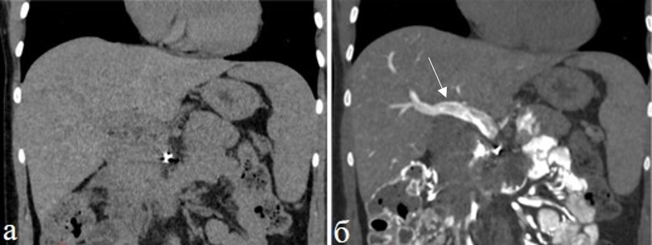

# Методика КТ-артериогепатикографии у больных с метастазами колоректального рака в печени после химиотерапии.
# Введение

Колоректальный рак (КРР) занимает третье место в структуре онкологической заболеваемости в мире с выявлением 1,1 млн новых случаев ежегодно и является второй ведущей причиной смерти от злокачественных новообразований [@sungGlobalCancerStatistics2021]. Метастазы в печени выявляются у 25 % пациентов на момент первичной диагностики КРР и у 50 % пациентов после резекции первичной опухоли [@vancutsemPanEuropeanConsensusTreatment2006]. 

Точность выявления метастазов печени варьирует в зависимости от размера образований и метода визуализации. В мета-анализе МРТ и КТ показали чувствительность 93,1 % и 82,1 % соответственно [@choiDiagnosticPerformanceCT2018]. Для образований диаметром <10 мм диагностические возможности существенно снижаются: чувствительность КТ составляет 16 %, МРТ — 74 % [@schulzDiagnosticPerformanceCT2016]. Интраоперационное УЗИ выявляет дополнительные метастазы у 33 % пациентов, которые не были обнаружены при предоперационной визуализации, что особенно эффективно для поражений <10 мм [@shahContrastenhancedIntraoperativeUltrasound2010]. Несмотря на совершенствование методов диагностики около 10% больных имеют нераспознанные предоперационные метастазы [@schulzDiagnosticPerformanceCT2016], а частота рецидивов после резекции печени остается на уровне более 50 % [@RepeatHepatectomyRecurrent2022]."

Выявление метастазов основано на различиях рентгеновской плотности между метастазом и окружающей тканью печени на нативных изображениях или на фоне введения контрастного препарата: йодсодержащего при КТ, гадолиний содержащего при МРТ, микропузырьков при УЗИ [@oldenburgDetectionHepaticMetastases2005]. Увеличение рентгеновской плотности достигается увеличением концентрации контрастирующих веществ, применением спектрального сканирования при КТ, использованием гепатоспецифичных препаратов при МРТ и прямым введением контрастного вещества в сосуды печени. При КТ метастазы колоректального рака проявляются как гиподенсные очаги относительно нормальной паренхимы печени [@matsuiLiverMetastasesColorectal1987]. Второй важный диагностический признак — периферический ободок контрастирования, который формируется вокруг метастаза при внутривенном или внутриартериальном введении контрастного препарата [@irieRimEnhancementColorectal1997]. Ободок накопления является известным признаком метастаза печени при КТ и МРТ, обладающий высокой специфичностью, но встречается только в 35-89 % метастазов колоректального рака [@chengEnhancedRimMDCT2020].

Гепатикография и возвратная портография широко использовались для выявления метастазов печени с помощью рентгеноскопии в 1970-80-х годах и КТ [@matsuiLiverMetastasesColorectal1987]. Методика применяется для обнаружения гиперваскулярных образований [@inoueDoublePhaseCT1998][@liMultiphasicCTArterial2004]. Однако визуализация гиповаскулярных метастазов колоректального рака остается затрудненной из-за артефактов неравномерной перфузии печени [@bluemkeNontumorousLowattenuationDefects1995]. Технология получила новое развитие с внедрением плоскодетекторной КТ (ПДКТ) и разработкой специализированных протоколов сканирования [@miyayama2012com, @balahninVnutriarterialnoeKontrastirovanieDlya2018]. Принцип методики основан на создании оптимальной капиллярной фазы контрастирования путем длительной инфузии контратсного препарта, обеспечивающего формирование выраженного ободка накопления вокруг метастазов. Это позволяет выявлять гиповаскулярные метастазы не на основании разности плотности очага и паренхимы печени, а благодаря появлению специфического периферического ободка контрастирования [@balahninVnutriarterialnoeKontrastirovanieDlya2018]. При использовании ПДКТ данный диагностический признак визуализируется у 100% метастазов колоректального рака [@balahninVnutriarterialnoeKontrastirovanieDlya2018].

Отношение сигнал/шум и чувствительность к артефактам дыхания у ПДКТ хуже, чем у КТ, поэтому целесообразно изучение протокола введения контрастного вещества, используемого при ПДКТ, в других модальностях.[@guptaFlatpanelVolumeCT2008][@pellerinDualphaseCarmCBCT2019]
Спиральная КТ отличается от ПДКТ по длительности сканирования, контрастности изображений, возможностям точного позиционирования катетера и максимальному допустимому инжекторами давлению. На первых этапах изучения этого подхода требуется оценка качества получаемых изображений, воспроизводимости получения капиллярной фазы контрастирования печени и ободка контрастирования метастаза колоректального рака после неоадъювантного лечения.

# Цель 

Предложить и апробировать методику КТ-артериогепатикографии для диагностики метастазов колоректального рака в печени после химиотерапии.

# Материалы и методы

В исследование включено 7 пациентов с колоректальным раком и метастазами в печени в возрасте от 37 до 78 лет, обследованных в ФГБУ «НМИЦ онкологии им. Н.Н. Петрова» Минздрава России. Все пациенты получали неоадъювантную химиотерапию на амбулаторном этапе с последующей госпитализацией для абляции или резекции метастазов печени. Выполнено 7 исследований КТ с внутриартериальным контрастированием.

Прототипом для предлагаемой методики КТ-артериогепатикографии послужил способ ПДКТ-артериогепатикографии с внутриартериальным введением 40 мл йодсодержащего контрастного препарата с концентрацией йода 370 мг/мл со скоростью инфузии 2 мл/сек [@balahninVnutriarterialnoeKontrastirovanieDlya2018].

Всем пациентам в условиях рентгеноперационной под местной анестезией 1% раствором лидокаина 10,0 выполнялась катетеризация правой бедренной артерии по Сельдингеру, чревного ствола и общей печеночной артерии при типичной анатомии целиако-мезентерального бассейна с использованием ангиографического катетера Cobra C2 5F и управляемого проводника. При вариантной анатомии с отхождением печеночных артерий от разных сосудов устанавливалось два катетера. Пациента на каталке транспортировали в отделение лучевой диагностики для выполнения МСКТ с внутриартериальным контрастированием.

КТ-исследование проводили на 128-срезовом КТ с параметрами: напряжение трубки 120 kV, автоматический контроль экспозиции, толщина среза 2 мм, питч 1. Зона сканирования ограничивалась печенью. Использовали контрастные препараты с содержанием йода 300-320 мг/мл.

При кровоснабжении печени из одной артерии вводили 40 мл неразведенного йодсодержащего контрастного препарата со скоростью 2 мл/с. При вариантной анатомии контрастное вещество вводили последовательно в каждую артерию по 20 мл со скоростью 1 мл/с. Интервал между сканированиями составлял 5 минут.

Первую фазу сканирования выполняли на 22 секунде от начала введения контрастного вещества для получения капиллярной фазы. 

У 6 пациентов проводили вторую фазу сканирования на 33-38 секундах. Выбор задержки был обусловлен минимальным временем, необходимым для возврата стола томографа и подготовки к повторному сканированию.

Для каждой фазы сканирования определяли наличие контрастного вещества в печеночных артериях, печеночных венах, портальной вене. Под капиллярной фазой подразумевали фазу на которой контрастное вещество отсутствует в печеночных артериях и присутствует в паренхиме печени и печеночных венах. 

На полученных изображениях в каждую из серий сканирования оценивали характер контрастирования печени и ее сосудов, число образований с КТ-картиной характерной для метастатического поражения, наличие гиперваскулярного ободка вокруг этих образований, критерием которого служило визуальное увеличение плотности линейной зоны по периферии.

Во все фазы сканирования оценивались участки транзиторного артериального усиления печени (ТАУП), которые представляли собой гиперденсные зоны неизмененной паренхимы печени [@kimTransientHepaticAttenuation2005][@colagrandeTransientHepaticAttenuation2004]. Основными дифференциально-диагностическими критериями ТАУП от патологических образований печени служили отсутствие масс-эффекта на соседние структуры, сохранность внутрипеченочного сосудистого рисунка в зоне изменений и характерная клиновидная или трапециевидная форма [@colagrandeTransientHepaticAttenuation2004][@kimTransientHepaticAttenuation2005]. Визуально оценивалась динамика ТАУП во второй фазе сканирования по сранвнению с первой по шкале: уменьшение выраженности, нет изменений, увеличение выраженности.

# Результаты

Типичная анатомия целиако-мезентериального бассейна была у 5 пациентов. Вариантная анатомия была у двух пациентов 3 и 9 типов по N.Michels.

У четырех пациентов (57%) на 22 секунде отмечалась капиллярная фаза контрастирования печени. У 3 пациентов контрастное вещество определялосвь в артериях печени и у 3 пациентов определялась возвратная портальная фаза. 

На сериях полученных на 33-38 секунде у всех 6 пациентов контрастирования артерий не отмечалось. Появления контрастного вещества в портальной вене также не было. 
 

Участки транзиторного усиления печени отмечены у 6 пациентов (86%) в первую фазу сканирования. Выраженность этих изменений уменьшились к 33-38 секунде у всех пациентов. 

Всего на МСКТ с внутриартериальным контрастированием выявлено 19 метастазов в печени. 

У 4 пациентов с фазами контрастирования на 22 и 33-38 секундах было выявлено 15 метастазов, их количество и наличие гиперваскулярного ободка в разные фазы сканирования идентично. 

У 1 пациента с фазами контрастирования на 22 и 33 секундах гиперваскулярный ободок у 4 метастазов не определялся, что было связано с выраженной кальцинацией очагов.

# Обсуждение

Ободок контрастирования вокруг очага является специфичным, хорошо изученным признаком метастаза печени [@irieRimEnhancementColorectal1997; @semelkaPerilesionalEnhancementHepatic2000; @ozakiLiverMetastasesCorrelation2022]. Этот признак универсален и определяется всеми методами лучевой диагностики. Периферический ободок контрастирования обусловлен комбинацией факторов: пролиферирующие опухолевые клетки по периферии, перитуморальная десмопластическая реакция, воспаление и неоангиогенез [@semelkaPerilesionalEnhancementHepatic2000, @irieRimEnhancementColorectal1997]. Согласно литературным данным, наиболее чувствительной методикой в выявлении этого признака является ПДКТ-артериография, при которой частота визуализации ободка контрастирования достигает 100% [@balahninVnutriarterialnoeKontrastirovanieDlya2018]. 

Мы исследовали, насколько эффективно этот признак выявляется при использовании спиральной КТ с протоколом внутриартериального введения контрастного вещества, основанного на протоколе ПДКТ. Перенос методики с одной модальности на другую представляет определенные трудности, связанные с различиями в временном и пространственном разрешении, а также в физических принципах формирования изображения.

П.В. Балахнин и соавторы описали методику ПДКТ инфузионной артериогепатикографии с введением 40 мл контрастного препарата с концентрацией йода 370 мг/мл со скоростью 2 мл/с и задержкой сканирования 22 секунды для получения капиллярной фазы [@balahninVnutriarterialnoeKontrastirovanieDlya2018]. В этой фазе контрастное вещество отсутствует в печеночных артериях, но присутствует в паренхиме печени и печеночных венах, что создает оптимальные условия для визуализации гиповаскулярных метастазов, за счет формирования периферического ободка контрастирования вокруг очагов, который обладает высокой специфичностью для метастатического поражения печени.  Мы адаптировали данный протокол для спиральной КТ, используя аналогичные параметры введения контрастного вещества. 

<!--объединить следующие два абзацы и вот тут начал говорить о том что надо как-то уйти от 22 секунды-->
Дополнительно мы исследовали вторую фазу сканирования на 33-38 секундах, поскольку имелись опасения относительно выраженности ТУАП на 22 секунде, которые могут маскировать мелкие метастазы или имитировать патологические изменения.
В нашем исследовании капиллярная фаза на 22 секунде была достигнута у 4 из 7 пациентов (57%), а на 33-38 секундах у 6 из 6 пациентов (100%). Частичная воспроизводимость методики на 22 секунде может быть обусловлена индивидуальными вариациями гемодинамики, различиями в позиционировании катетера и техническими особенностями спиральной КТ по сравнению с ПДКТ.

Гиперваскулярный ободок контрастирования визуализировался у 15 необызвествленных метастазов (100%), что существенно превосходит литературные данные о выявлении ободка при стандартных КТ и МРТ с внутривенным контрастированием, где частота визуализации составляет 35-89% [@chengEnhancedRimMDCT2020]. Высокая частота выявления ободка в нашем исследовании сопоставима с результатами ПДКТ-артериографии и подтверждает эффективность прямого внутриартериального введения контрастного вещества для визуализации этого важного диагностического признака.

Важным наблюдением стало то, что частота выявления и выраженность ободка контрастирования были идентичными в обе фазы сканирования (22 и 33-38 секунд). Это согласуется с данными других исследований. Li и соавторы продемонстрировали сохранение визуализации гиперваскулярного ободка на 40 секунде сканирования при многофазной КТ-артериогепатикографии [@liMultiphasicCTArterial2004]. Inoue и соавторы показали, что при двухфазной КТ-артериографии 80% метастазов демонстрировали контрастирование ободка на 12 секунде, и только 73% сохраняли это контрастирование во второй фазе [@inoueDoublePhaseCT1998]. Расхождения между частотой появления ободка во второй фазе между нашими исследованиями может быть связано с разной задержкой. В исследовании Inoue E. et al. второе сканирование выполнялось через 20 секунд после окончания первого. В нашем исследовании разница между окончанием первой и началом второй фазы составляла около 5 с. [@inoueDoublePhaseCT1998]

Основным фактором, затрудняющим анализ изображений при внутриартериальном контрастировании, являются выраженные ТАУП. В нашем исследовании они встречались у 6 пациентов из 7 (86%) при сканировании на 22 секунде. Столь высокая частота встречаемости существенно превышает данные, приводимые для ТУАП при стандартной КТ с внутривенным контрастированием 9.3-13.2% [@yamasakiTransientHepaticAttenuation1999, @colagrandeTransientHepaticAttenuation2002] и КТ-портографии 34-60.7% пациентов [nelsonCTArterialPortography1992]. Важно отметить, что прямое сопоставление нашего результатов с литературными данными затруднено из-за различий в методике контрастирования. Большинство опубликованных исследований описывают ТУАП при внутривенном введении контрастного препарата, в то время как селективная внутриартериальная КТ-артериография создает принципиально иные гемодинамические условия с более выраженной гетерогенностью артериального кровоснабжения печени. Дополнительным фактором, объясняющим 100% встречаемость транзиторного усиления в нашей серии, является предшествующая химиотерапия у всех включенных пациентов. По данным Roth et al. (1989), артериальные перфузионные аномалии выявляются у 60% пациентов после 6 месяцев химиотерапии и у 82% после года лечения [rothArterialPerfusionAbnormalities1989].

Важно, что на 33-38 секундах выраженность ТУАП уменьшилась у всех пациентов. Таким образом, сканирование на 33-38 секундах представляется более предпочтительным, поскольку выраженность ободка контрастирования сохраняется, но улучшается визуализация паренхимы печени за счет отсутствия перфузионных артефактов.

Наше исследование имеет ряд ограничений. Малый размер выборки (7 пациентов) ограничивает статистическую мощность анализа. Отсутствие прямого сопоставления КТ-артериографии с другими методами визуализации не позволяет количественно оценить диагностическое преимущество методики. Просмотр всех изображений одним рентгенологом создает потенциальную субъективность в оценке наличия и выраженности ободка контрастирования, хотя это частично компенсировано использованием объективных критериев толщины ободка. Необходимы дальнейшие исследования с большей выборкой и мультицентровым дизайном для валидации предложенной методики.

# Выводы

Предложенная методика КТ-артериогепатикографии демонстрирует воспроизводимые результаты независимо от анатомических вариантов кровоснабжения печени. Капиллярная фаза контрастирования на 33-38 секундах представляется более перспективной чем на 22 секунде, так как характеризуется меньшей выраженностью артефактов и сохранением визуализации ободка контрастирования вокруг метастазов.